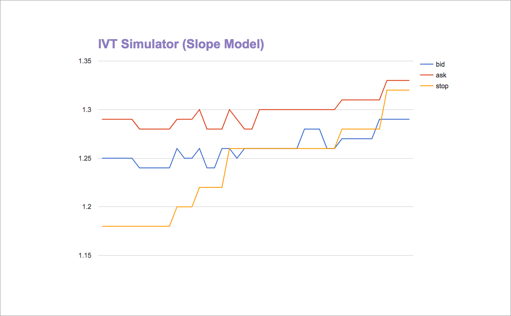

## Overview

This is the area of the application that will be dedicated to functions that calculate the trailing stop loss and other mathmatical models that will support the strategies employed at Groundwire.

## File Layout

Each strategy function will be in its own file.  For instance a function that calculates the trailing stop loss value for the slope method will be in its own file called `slope.js`.  The file will simply export the anonymous function using Node's `module.exports` convention.

## Strategies Supported

| Strategy             | Description                                            | Graphic Example                                    |
| -------------------- | ------------------------------------------------------ | -------------------------------------------------- |
| Slope Model          | This strategy calculates the next stop loss price by directly correlating it the the slope in the price action between each tick | 